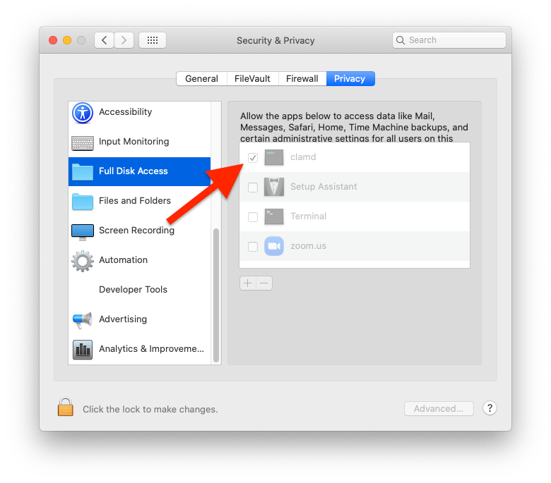

# role-clamav

### Master:
- Travis CI: 
- Github Actions: [](https://github.com/osx-provisioner/role-clamav/actions/workflows/push.yml)

### Production:
- Travis CI: 
- Github Actions: [](https://github.com/osx-provisioner/role-clamav/actions/workflows/push.yml)

Ansible role that installs ClamAV antivirus on OSX machines.

### Notes:
- See the [ClamAV Github Repository](https://github.com/Cisco-Talos/clamav) for further details about this tool.

### Catalina and Big Sur:

On OSX versions >= 10.15, there's a manual post installation step that should be done to maximize protection.  (This is required to monitor the `Downloads` folder.)

ClamAV should be granted `Full Disk Access`.  This requires making the appropriate selection inside `System Preferences --> Security`:



Requirements
------------

None

Role Variables
--------------

- `clamav_clamwatch` 
  - A boolean that indicates whether the ClamWatch daemon should be installed.
- `clamav_clamwatch_target_folder:` 
  - The folder the ClamWatch daemon will monitor.
- `clamav_clamwatch_quarantine_folder` 
  - The folder the ClamWatch daemon will move infected files to.
- `clamav_clamwatch_log_file` 
  - The ClamWatch daemon log file.
- `clamav_clamwatch_stderr_log_file` 
  - The ClamWatch daemon error log file.
- `clamav_freshclam_log_file` 
  - The FreshClam daemon log file.
- `clamav_freshclam_stderr_log_file` 
  - The FreshClam daemon error log file.
- `clamav_clamd_log_file` 
  - The ClamD daemon log file.
- `clamav_clamd_stderr_log_file` 
  - The ClamD daemon error log file. 
- `clamav_database_location` 
  - The location of the virus definition database.
- `clamav_homebrew_retries`:
  - Sets the number of attempts homebrew will make to install dependencies. (For flaky network connections.)
  
[See The Default Values](defaults/main.yml)

Dependencies
------------

- geerlingguy.homebrew

Example Playbook
----------------

```yaml
- hosts: email
  roles:
  - role: osx_provisioner.clamav
    clamav_clamwatch: true
    clamav_clamwatch_target_folder: "{{ lookup('env','HOME') }}/Downloads"
    clamav_clamwatch_quarantine_folder: "{{ lookup('env','HOME') }}/Quarantine"
    clamav_clamwatch_log_file: /var/log/clamav.clamwatch.log
    clamav_clamwatch_stderr_log_file: /var/log/clamav.clamwatch.error.log
    clamav_freshclam_log_file: /var/log/clamav.freshclam.log
    clamav_freshclam_stderr_log_file: /var/log/clamav.freshclam.error.log
    clamav_clamd_log_file: /var/log/clamav.clamd.log
    clamav_clamd_stderr_log_file: /var/log/clamav.clamd.error.log
    clamav_database_location: /usr/local/var/lib/clamav
```

License
-------

MPL-2

Author Information
------------------

Niall Byrne <niall@niallbyrne.ca>
